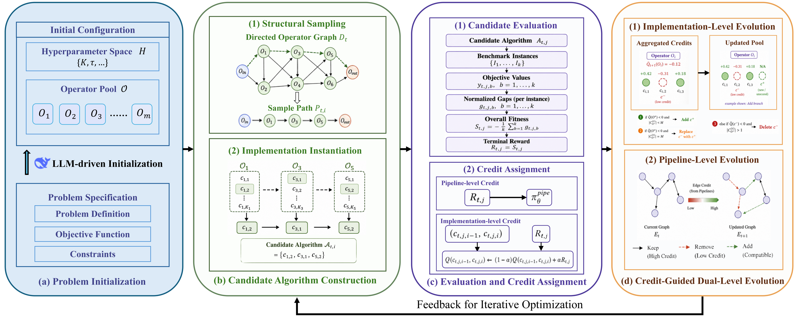
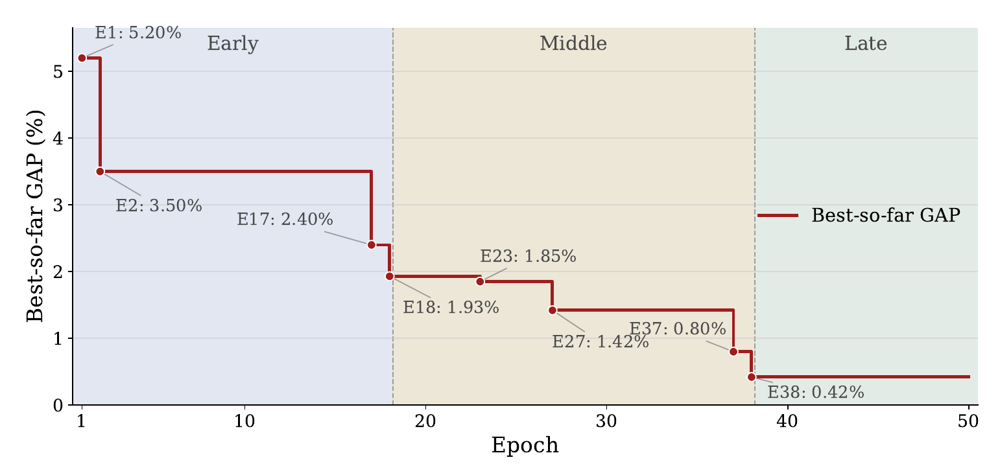

# DGA2D: Directed Graph-Guided Automated Algorithm Design with Large Language Models

🥳 **Welcome!** This is the codebase accompanying the paper [*DGA2D: Directed Graph-Guided Automated Algorithm Design with Large Language Models*](https://arxiv.org/abs/2608.00700).

**Let LLMs design both the algorithmic structure and its operators!**

## Table of Contents

* 1\. [News 📰](#1-news-)
* 2\. [Introduction 🚀](#2-introduction-)
* 3\. [Exciting Highlights 🌟](#3-exciting-highlights-)
* 4\. [Usage 🔑](#4-usage-)
  * 4.1. [Installation](#41-installation)
  * 4.2. [To run DGA2D](#42-to-run-dga2d)
  * 4.3. [Available problems](#43-available-problems)
  * 4.4. [Simple steps to apply DGA2D to your problem](#44-simple-steps-to-apply-dga2d-to-your-problem)
  * 4.5. [Use Alternative LLMs](#45-use-alternative-llms)
* 5\. [Citation 🤩](#5-citation-)

## 1. News 📰

- **Aug. 2026:** Our paper is available on [arXiv](https://arxiv.org/abs/2608.00700).

## 2. Introduction 🚀



We introduce **DGA2D**, a framework for **system-level automated algorithm design** with large language models. It represents the algorithm search space as a directed graph: nodes are functional operators with multiple candidate code implementations, and bounded directed walks form complete executable pipelines.

DGA2D **jointly evolves operator implementations and graph connectivity**. A **first-order path-dependent credit assignment mechanism** evaluates implementations in the context of their immediate predecessors, guiding implementation selection and dual-level evolution.

The current engine samples constrained graph walks with a local LoRA policy and updates it using REINFORCE. Markov credit guides implementation selection and evolution, while all generations use a fixed evolution batch of shared training instances. The provided experiment presets include credit ablation.

The following figure shows the evolution of DGA2D on CVRP over 50 epochs. The best-so-far optimality gap decreases from 5.20% to 0.42%, with rapid early improvement, continued refinement in the middle stage, and stable convergence in the late stage.



## 3. Exciting Highlights 🌟

DGA2D enables:

- **System-level design:** evolve complete algorithmic pipelines and their operator implementations.
- **Flexible composition:** reuse operators through directed graph walks, including iterative structures.
- **Context-aware search:** guide implementation selection and evolution with path-dependent credit.

across four categories of combinatorial optimization problems:

- Scheduling
- Vehicle routing
- Spatial allocation
- Graph optimization

## 4. Usage 🔑

- Configure the proposer in `.env` using your API key, endpoint, and model name.
- Prepare benchmark data following [DATASETS.md](./DATASETS.md).
- Running logs, generated operators, checkpoints, and results are saved in `runs/<problem>/<timestamp>/`.

#### 4.1. Installation

Training supports **Python 3.13** on **Windows/Linux x86-64**, with an **NVIDIA CUDA GPU** and **PyTorch 2.6.0 / CUDA 12.6**. Install [uv](https://docs.astral.sh/uv/getting-started/installation/) (0.12.23 or later in the 0.12 series), then run from the repository root:

```bash
uv sync --locked --extra cu126
```

uv creates `.venv` and obtains Python 3.13 if needed. If `.venv` belongs to an existing experiment or uses another Python version, use a separate checkout or set `UV_PROJECT_ENVIRONMENT` to a new directory before syncing. Keep that setting for subsequent commands. Do not sync over an environment used by a running experiment.

For CPU-based unit tests and dependency checks, use `uv sync --locked --extra cpu`. The `cpu` and `cu126` options are mutually exclusive; CPU checks do not validate GPU training. Dependencies are declared in `pyproject.toml` and resolved in the committed `uv.lock`; use `--locked` to avoid implicit lock changes.

#### 4.2. To run DGA2D

First prepare the benchmark group following [DATASETS.md](./DATASETS.md). For example, import locally obtained FSSP data, replacing the source path below:

```bash
uv run --locked --extra cu126 python scripts/prepare_data.py --problem fssp --group tai20_5 --source "/path/to/benchmarks/fssp"
uv run --locked --extra cu126 python scripts/prepare_data.py --problem fssp --group tai20_5 --verify-only
```

Copy `.env.example` to `.env` and fill in your proposer settings:

```powershell
Copy-Item .env.example .env  # PowerShell; on Linux: cp .env.example .env
```

```dotenv
LLM_API_KEY=<provider-key>
LLM_BASE_URL=https://api.example.com/v1
LLM_MODEL_NAME=<model-name>
LLM_TEMPERATURE=0.7
```

Then start DGA2D:

```powershell
# Example: FSSP with a directed graph and first-order credit
uv run --locked --extra cu126 python main.py problem=fssp structure=dg credit=first
```

Check out [cfg/config.yaml](./cfg/config.yaml) for more options. The default problem is `3dclp`; this example explicitly selects `fssp`.

#### 4.3. Available problems

- Job-Shop Scheduling (JSP): `jsp`
- Flexible Job-Shop Scheduling (FJSP): `fjsp`
- Flow-Shop Scheduling (FSSP): `fssp`
- Open-Shop Scheduling (OSSP): `ossp`
- Resource-Constrained Project Scheduling (RCPSP): `rcpsp`
- Simple Assembly Line Balancing (SALBP-1): `salbp`
- Traveling Salesperson Problem (TSP): `tsp`
- Capacitated Vehicle Routing Problem (CVRP): `cvrp`
- Three-Dimensional Bin Packing (3D-BPP): `3dbbp`
- Three-Dimensional Container Loading (3D-CLP): `3dclp`
- Maximum Independent Set (MIS): `mis`
- Maximum Cut (Max-Cut): `max_cut`

#### 4.4. Simple steps to apply DGA2D to your problem

- Define the problem and target benchmark group in `cfg/problem/`.
- Implement the domain evaluator and initial operator slots in `src/problems/<problem>/`, following the existing FSSP example. Each operator exposes `run(env_data, state, calc_makespan_fn)`.
- Add domain knowledge in `prompts/<problem>/`, prepare the benchmark data, and run `main.py problem=<problem>`.

#### 4.5. Use Alternative LLMs

Use `llm=openai_compatible` with the `LLM_*` settings above for an OpenAI-compatible proposer service. Two additional configurations are provided:

- **DeepSeek:** `llm=deepseek_v4_flash`, using `DEEPSEEK_API_KEY`; the preset model is `deepseek-v4-flash`.
- **OpenAI:** `llm=gpt_5_6_sol`, using `OPENAI_API_KEY`; the preset model is `gpt-5.6-sol`.

Add the corresponding key to `.env`, then select the configuration:

```powershell
uv run --locked --extra cu126 python main.py problem=fssp llm=deepseek_v4_flash
uv run --locked --extra cu126 python main.py problem=fssp llm=gpt_5_6_sol
```

Override endpoint and model identifiers with `DEEPSEEK_BASE_URL` / `DEEPSEEK_MODEL_NAME` or `OPENAI_BASE_URL` / `OPENAI_MODEL_NAME` when needed.

The **pipeline policy** is separate from the proposer: it runs locally with LoRA, defaults to `Qwen/Qwen2.5-0.5B-Instruct`, and is configured through `policy.*`.

## 5. Citation 🤩

If you find our work helpful, please consider citing our paper:

```bibtex
@article{zhao2026dga,
  title={DGA $ \_2 $ D: Directed Graph-Guided Automated Algorithm Design with Large Language Models},
  author={Zhao, Jiale and Chen, Zimu and Mao, Sirui and Yang, Wentao and Bai, Yuxiang and Lai, Liyuanjun},
  journal={arXiv preprint arXiv:2608.00700},
  year={2026}
}
```
